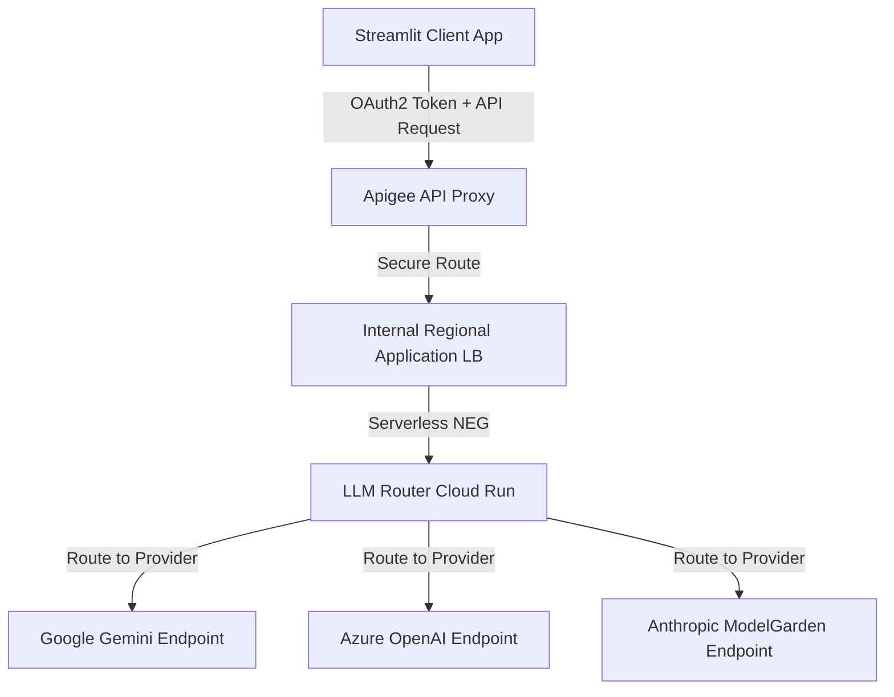

# Apigee LLM Gateway

This repository implements an LLM Gateway solution using Apigee for API management, an Internal Load Balancer, and a custom Router running on Cloud Run.

## Architecture Flow

The overall request flow is as follows:

`Client -> Apigee Proxy -> Internal Load Balancer -> Serverless NEG -> LLM Router (Cloud Run) -> Target LLM Endpoints`

### Diagram



## Components and Deployment

### 1. LLM Router (`/llm-router`)
A Node.js application that receives requests and routes them to the appropriate LLM provider based on configuration.
*   **Configuration**: Before deploying, you must edit `llm-router/eval.properties` to fill in your actual project ID, hostnames, and API keys for the LLM providers.
*   **Deployment**: Run the `deploy_router.sh` script in the root directory.
    ```bash
    ./deploy_router.sh
    ```
    This script deploys the router to Cloud Run with ingress restricted to internal and load balancing traffic. Ensure you have configured `env.sh` with `ROUTER_SERVICE_ACCOUNT` first.

### 2. Internal Load Balancer & Serverless NEG
Routes traffic from Apigee to the Cloud Run backend securely within the VPC.
*   **Configuration**: You need to configure an **Internal Regional HTTP Load Balancer** in your GCP environment.
*   **Crucial Step**: The backend of this Load Balancer must be a **Serverless Network Endpoint Group (NEG)** pointing to the `llm-router` Cloud Run service. This allows the internal load balancer to route traffic to the serverless Cloud Run service.
*   **SSL Certificates**: If you use a frontend IP for the Load Balancer, you must configure SSL certificates for hostnames like `primary.[frontend-ip].nip.io` and `fallback.[frontend-ip].nip.io`.
*   **Apigee Target Servers**: In the Apigee console, you must register Target Servers named `llm-primary` and `llm-fallback` with their respective hostnames.

### 3. Apigee Proxy (`/apiproxy`)
Manages authentication (OAuth2), quota, and acts as the entry point.
*   **Configuration**: Before deploying, you must edit `apiproxy/targets/default.xml` to modify the `<Audience>` value to match your Cloud Run service's audience (usually the Cloud Run URL).
*   **Deployment**: Run the `deploy_proxy.sh` script in the root directory.
    ```bash
    ./deploy_proxy.sh
    ```
    Ensure you have configured `env.sh` first with your project, environment, and `PROXY_NAME` details.

### 4. Client Application (`/client`)
A Streamlit-based web application for demonstrating the LLM Gateway.
*   **Configuration**: Edit the `.env` file in the `client` directory and set the following variables with your actual Apigee credentials:
    *   `APIGEE_HOSTNAME`: The hostname of your Apigee gateway.
    *   `BASIC_CLIENT_ID`: Client ID for the Basic tier.
    *   `BASIC_CLIENT_SECRET`: Client Secret for the Basic tier.
    *   `PREMIUM_CLIENT_ID`: Client ID for the Premium tier.
    *   `PREMIUM_CLIENT_SECRET`: Client Secret for the Premium tier.    
*   **Deployment**: Run `deploy_client.sh` to deploy the client app to Cloud Run.
