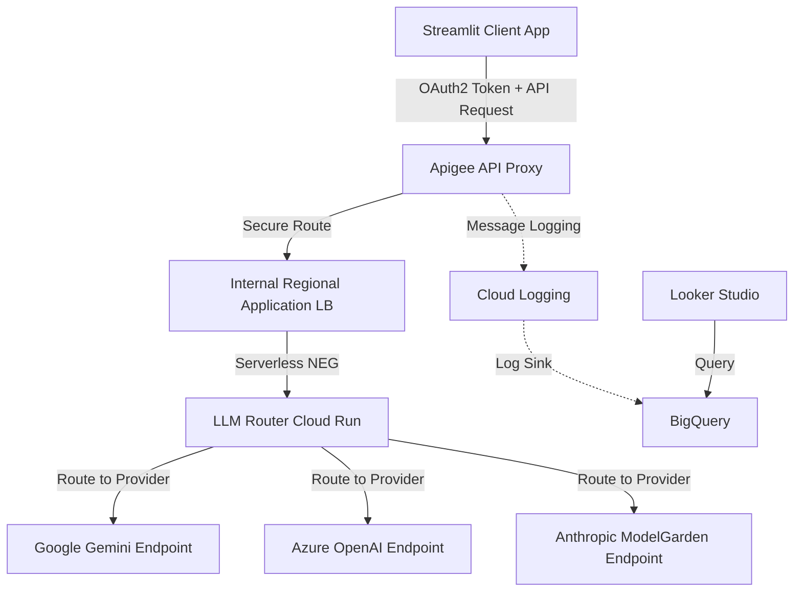

# Apigee LLM Gateway

This repository implements an LLM Gateway solution using Apigee for API management, an Internal Load Balancer, and a custom Router running on Cloud Run.

## Architecture Flow

The overall request flow is as follows:

`Client -> Apigee Proxy -> Internal Load Balancer -> Serverless NEG -> LLM Router (Cloud Run) -> Target LLM Endpoints`

### Diagram



## Components and Deployment

### 1. LLM Router (`/llm-router`)
A Node.js application that receives requests and routes them to the appropriate LLM provider based on configuration.
*   **Configuration**: Before deploying, you must edit `llm-router/eval.properties` to fill in your actual project ID, hostnames, and API keys for the LLM providers.
*   **Deployment**: Run the `deploy_router.sh` script in the root directory.
    ```bash
    ./deploy_router.sh
    ```
    This script deploys the router to Cloud Run with ingress restricted to internal and load balancing traffic. Ensure you have configured `env.sh` with `ROUTER_SERVICE_ACCOUNT` first.

### 2. Internal Load Balancer & Serverless NEG
Routes traffic from Apigee to the Cloud Run backend securely within the VPC.
*   **Configuration**: You need to configure an **Internal Regional HTTP Load Balancer** in your GCP environment.
*   **Crucial Step**: The backend of this Load Balancer must be a **Serverless Network Endpoint Group (NEG)** pointing to the `llm-router` Cloud Run service. This allows the internal load balancer to route traffic to the serverless Cloud Run service.
*   **SSL Certificates**: If you use a frontend IP for the Load Balancer, you must configure SSL certificates for hostnames like `primary.[frontend-ip].nip.io` and `fallback.[frontend-ip].nip.io`.
*   **Apigee Target Servers**: In the Apigee console, you must register Target Servers named `llm-primary` and `llm-fallback` with their respective hostnames.

### 3. Apigee Proxy (`/apiproxy`)
Manages authentication (OAuth2), quota, and acts as the entry point.
*   **Configuration**: Before deploying, you must edit `apiproxy/targets/default.xml` to modify the `<Audience>` value to match your Cloud Run service's audience (usually the Cloud Run URL).
*   **Deployment**: Run the `deploy_proxy.sh` script in the root directory.
    ```bash
    ./deploy_proxy.sh
    ```
    Ensure you have configured `env.sh` first with your project, environment, and `PROXY_NAME` details.
*   **Post-Deployment Configuration (Apigee Console)**:
    1.  **Create API Products**:
        *   Create a **Bronze** product and configure both **Call Based Quota** and **Token Based Quota** (e.g., set relatively low limits).
        *   Create a **Gold** product and configure both **Call Based Quota** and **Token Based Quota** (e.g., set higher limits than Bronze).
    2.  **Create Developer Apps**:
        *   Create a **Basic App** and subscribe it to the **Bronze** API Product.
        *   Create a **Premium App** and subscribe it to the **Gold** API Product.
    3.  **Get Credentials**: For both apps, note the `Consumer Key` (Client ID) and `Consumer Secret` (Client Secret). You will need these in Step 4.

### 4. Client Application (`/client`)
A Streamlit-based web application for demonstrating the LLM Gateway.
*   **Configuration**: Edit the `.env` file in the `client` directory and set the following variables with the credentials obtained in Step 3:
    *   `APIGEE_HOSTNAME`: The hostname of your Apigee gateway.
    *   `BASIC_CLIENT_ID`: Client ID for the Basic tier (from Basic App).
    *   `BASIC_CLIENT_SECRET`: Client Secret for the Basic tier (from Basic App).
    *   `PREMIUM_CLIENT_ID`: Client ID for the Premium tier (from Premium App).
    *   `PREMIUM_CLIENT_SECRET`: Client Secret for the Premium tier (from Premium App).    
*   **Deployment**: Run `deploy_client.sh` to deploy the client app to Cloud Run.

### 5. Logging & Dashboard Setup
Configure log pipeline from Apigee to BigQuery and visualize in Looker Studio.
*   **Logger Verification**: The deployed Apigee proxy uses a Message Logging policy (`apiproxy/policies/ML-cloudLogging.xml`) that writes logs to a log name matching `aigw-multillm-demo`.
*   **Log Pipeline Configuration**:
    1.  **Create BigQuery Dataset**: Create a dataset in BigQuery to store the logs.
    2.  **Create Log Sink**: In Google Cloud Logging, create a Log Sink with the following settings:
        *   **Sink Destination**: BigQuery dataset (select the one created above).
        *   **Inclusion Filter**: `logName:"projects/[PROJECT_ID]/logs/aigw-multillm-demo"` (Replace `[PROJECT_ID]` with your actual project ID).
*   **Dashboard Configuration**:
    1.  Open **Looker Studio** and create a new report.
    2.  Add data using the **BigQuery** connector.
    3.  Select your project, dataset, and the table created by the Log Sink.
    4.  Create charts and tables to visualize metrics such as token usage, response times, and errors based on the fields logged by the Message Logging policy.
*   **Reference Links**:
    *   [Apigee Message Logging Policy Documentation](https://cloud.google.com/apigee/docs/api-platform/reference/policies/message-logging-policy)
    *   [Cloud Logging: Routing and sinking logs](https://cloud.google.com/logging/docs/export/configure_export_v2)
    *   [Looker Studio: Connect to BigQuery](https://cloud.google.com/looker-studio/docs/connector-bigquery)
